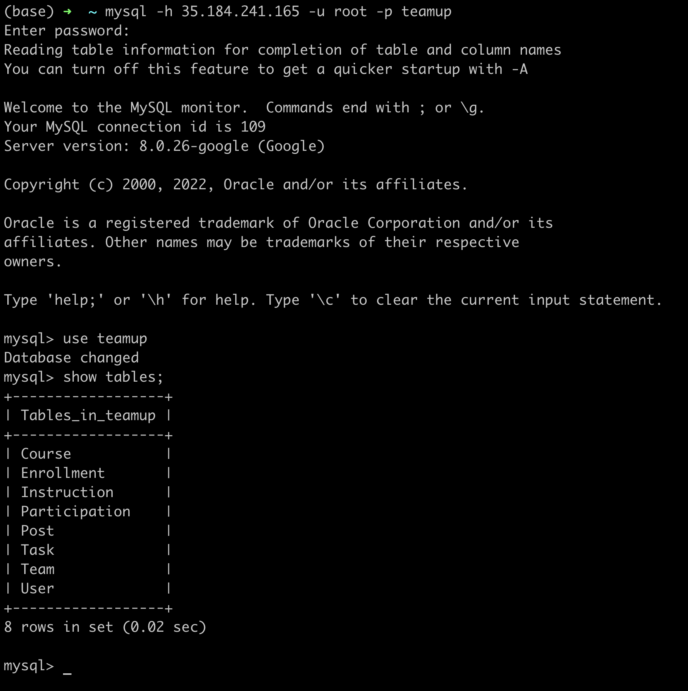
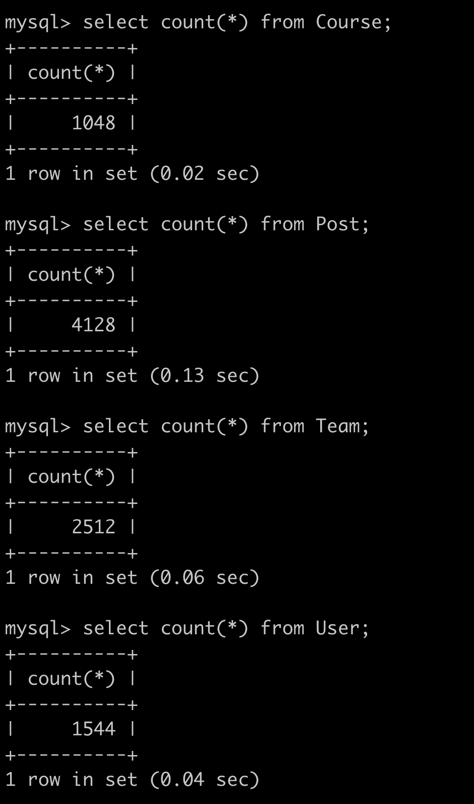
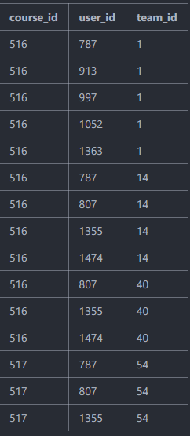
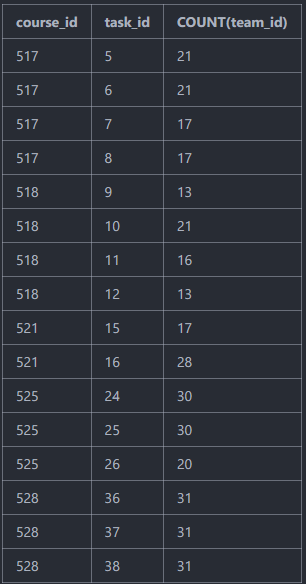

# Stage 3.  Q-team033-DianasDog

## Database implementation

### 1. Implementing the database on GCP

Screenshot of the connection



### 2. DDL commands

##### Course

```sql
DROP TABLE IF EXISTS `Course`;

CREATE TABLE `Course` (
  `course_id` int unsigned NOT NULL AUTO_INCREMENT,
  `semester` varchar(10) CHARACTER SET utf8mb4 COLLATE utf8mb4_0900_ai_ci NOT NULL,
  `register_code` varchar(20) CHARACTER SET utf8mb4 COLLATE utf8mb4_0900_ai_ci NOT NULL,
  `course_name` varchar(255) CHARACTER SET utf8mb4 COLLATE utf8mb4_0900_ai_ci NOT NULL,
  `course_num` varchar(255) CHARACTER SET utf8mb4 COLLATE utf8mb4_0900_ai_ci NOT NULL,
  PRIMARY KEY (`course_id`)
) ENGINE=InnoDB DEFAULT CHARSET=utf8mb4 COLLATE=utf8mb4_0900_ai_ci;
```


##### Enrollment

```sql
DROP TABLE IF EXISTS `Enrollment`;

CREATE TABLE `Enrollment` (
  `course_id` int unsigned NOT NULL,
  `user_id` int unsigned NOT NULL,
  PRIMARY KEY (`course_id`,`user_id`),
  KEY `enrollment_to_user_userid` (`user_id`),
  CONSTRAINT `enrollment_to_course_courseid` FOREIGN KEY (`course_id`) REFERENCES `Course` (`course_id`) ON DELETE CASCADE ON UPDATE CASCADE,
  CONSTRAINT `enrollment_to_user_userid` FOREIGN KEY (`user_id`) REFERENCES `User` (`user_id`) ON DELETE CASCADE ON UPDATE CASCADE
) ENGINE=InnoDB DEFAULT CHARSET=utf8mb4 COLLATE=utf8mb4_0900_ai_ci;
```

##### Instruction

```sql
DROP TABLE IF EXISTS `Instruction`;

CREATE TABLE `Instruction` (
  `user_id` int unsigned NOT NULL,
  `course_id` int unsigned NOT NULL,
  PRIMARY KEY (`user_id`,`course_id`),
  KEY `instruction_to_course_courseid` (`course_id`),
  CONSTRAINT `instruction_to_course_courseid` FOREIGN KEY (`course_id`) REFERENCES `Course` (`course_id`) ON DELETE CASCADE ON UPDATE CASCADE,
  CONSTRAINT `instruction_to_user_userid` FOREIGN KEY (`user_id`) REFERENCES `User` (`user_id`) ON DELETE CASCADE ON UPDATE CASCADE
) ENGINE=InnoDB DEFAULT CHARSET=utf8mb4 COLLATE=utf8mb4_0900_ai_ci;
```

##### Participation

```sql
DROP TABLE IF EXISTS `Participation`;

CREATE TABLE `Participation` (
  `user_id` int unsigned NOT NULL,
  `team_id` int unsigned NOT NULL,
  PRIMARY KEY (`user_id`,`team_id`),
  KEY `participation_to_team_teamid` (`team_id`),
  CONSTRAINT `participation_to_team_teamid` FOREIGN KEY (`team_id`) REFERENCES `Team` (`team_id`) ON DELETE CASCADE ON UPDATE CASCADE,
  CONSTRAINT `participation_to_user_userid` FOREIGN KEY (`user_id`) REFERENCES `User` (`user_id`) ON DELETE CASCADE ON UPDATE CASCADE
) ENGINE=InnoDB DEFAULT CHARSET=utf8mb4 COLLATE=utf8mb4_0900_ai_ci;
```

##### Post

```sql
DROP TABLE IF EXISTS `Post`;

CREATE TABLE `Post` (
  `post_id` int unsigned NOT NULL,
  `task_id` int unsigned NOT NULL,
  `course_id` int unsigned NOT NULL,
  `user_id` int unsigned NOT NULL,
  `time_slot` varchar(255) DEFAULT NULL,
  `weekend_availability` int NOT NULL DEFAULT '0' COMMENT '0 - NO 1 - YES',
  `previous_experience` int NOT NULL DEFAULT '0' COMMENT '0 - None but willing to learn 1 - Partly experienced 2 - Fully experienced 3 - Expert',
  `team_work_style` int NOT NULL DEFAULT '0' COMMENT '0 - DDL pushes us 1 - Open to any 2 - As early as possible',
  PRIMARY KEY (`post_id`,`task_id`,`course_id`,`user_id`),
  KEY `post_to_user_userid` (`user_id`),
  KEY `post_to_task_taskid` (`task_id`),
  KEY `post_to_task_courseid` (`course_id`),
  CONSTRAINT `post_to_task_courseid` FOREIGN KEY (`course_id`) REFERENCES `Task` (`course_id`) ON DELETE CASCADE ON UPDATE CASCADE,
  CONSTRAINT `post_to_task_taskid` FOREIGN KEY (`task_id`) REFERENCES `Task` (`task_id`) ON DELETE CASCADE ON UPDATE CASCADE,
  CONSTRAINT `post_to_user_userid` FOREIGN KEY (`user_id`) REFERENCES `User` (`user_id`) ON DELETE CASCADE ON UPDATE CASCADE
) ENGINE=InnoDB DEFAULT CHARSET=utf8mb4 COLLATE=utf8mb4_0900_ai_ci;
```

##### Task

```sql
DROP TABLE IF EXISTS `Task`;

CREATE TABLE `Task` (
  `task_id` int unsigned NOT NULL,
  `course_id` int unsigned NOT NULL,
  `type` int NOT NULL DEFAULT '0' COMMENT '0 for self; 1 for random',
  `task_name` varchar(255) CHARACTER SET utf8mb4 COLLATE utf8mb4_0900_ai_ci NOT NULL,
  `max_size` int NOT NULL,
  PRIMARY KEY (`task_id`,`course_id`),
  KEY `task_to_course_courseid` (`course_id`),
  CONSTRAINT `task_to_course_courseid` FOREIGN KEY (`course_id`) REFERENCES `Course` (`course_id`) ON DELETE CASCADE ON UPDATE CASCADE
) ENGINE=InnoDB DEFAULT CHARSET=utf8mb4 COLLATE=utf8mb4_0900_ai_ci;
```

##### Team

```sql
DROP TABLE IF EXISTS `Team`;

CREATE TABLE `Team` (
  `team_id` int unsigned NOT NULL,
  `task_id` int unsigned NOT NULL,
  `course_id` int unsigned NOT NULL,
  PRIMARY KEY (`team_id`,`task_id`),
  KEY `team_to_task_taskid` (`task_id`),
  CONSTRAINT `team_to_task_taskid` FOREIGN KEY (`task_id`) REFERENCES `Task` (`task_id`) ON DELETE CASCADE ON UPDATE CASCADE
) ENGINE=InnoDB DEFAULT CHARSET=utf8mb4 COLLATE=utf8mb4_0900_ai_ci;
```


##### User

```sql
DROP TABLE IF EXISTS `User`;

CREATE TABLE `User` (
  `user_id` int unsigned NOT NULL AUTO_INCREMENT,
  `identity` int NOT NULL DEFAULT '0' COMMENT '0 for student; 1 for instructor',
  `name` varchar(255) DEFAULT NULL,
  `gender` int DEFAULT NULL,
  `password` varchar(255) CHARACTER SET utf8mb4 COLLATE utf8mb4_0900_ai_ci NOT NULL,
  `email_address` varchar(255) CHARACTER SET utf8mb4 COLLATE utf8mb4_0900_ai_ci NOT NULL,
  PRIMARY KEY (`user_id`)
) ENGINE=InnoDB DEFAULT CHARSET=utf8mb4 COLLATE=utf8mb4_0900_ai_ci;
```

### 3. Insert at least 1000 rows

Screenshots



## Advanced Queries

##### Query 1:

One student searches all teams he/she is in. This query used 2 concepts required: 1) Join of multiple relations, 2) Use of subqueries

```sql
SELECT user_id, team_id
FROM participation
WHERE team_id IN (SELECT team_id
            FROM user NATURAL JOIN participation
            WHERE user_id = 787) 
            # user_id = Input from front end
LIMIT 15
```

Output:




##### Query 2:

An instructor searches the number of current teams for tasks of courses. This query used 2 concepts required: 1) Join of multiple relations, 2) Use of subqueries

```sql
select course_id, task_id, count(team_id) as count_team 
       from Team natural join 
       (select course_id, task_id 
               from Instruction natural join Task where user_id = 403 order by course_id asc ) as temp  # user_id = 403 is an input from the front-end
group by course_id, task_id
```

Output:



## Indexing Analysis

##### Query 1:

Without indexing:

```sql
-> Nested loop inner join  (cost=139.62 rows=516) (actual time=0.044..1.106 rows=565 loops=1)
    -> Nested loop inner join  (cost=56.91 rows=124) (actual time=0.037..0.542 rows=124 loops=1)
        -> Covering index lookup on participation using PRIMARY (user_id=787)  (cost=13.51 rows=124) (actual time=0.029..0.058 rows=124 loops=1)
        -> Index lookup on team using PRIMARY (team_id=participation.team_id)  (cost=0.25 rows=1) (actual time=0.003..0.004 rows=1 loops=124)
    -> Covering index lookup on participation using participation_to_team_teamid (team_id=participation.team_id)  (cost=0.25 rows=4) (actual time=0.002..0.004 rows=5 loops=124)
```

1. Index on participation(user_id, team_id). 

   We index on attributes user_id and team_id in the participation table and observed no difference in searching time for that attribute. This is because user_id and team_id are already primary keys. And primary keys are on default indexed.

   ```sql
   -> Nested loop inner join  (cost=138.82 rows=516) (actual time=0.045..1.084 rows=565 loops=1)
      -> Nested loop inner join  (cost=56.11 rows=124) (actual time=0.037..0.535 rows=124 loops=1)
          -> Covering index lookup on participation using PRIMARY (user_id=787)  (cost=12.71 rows=124) (actual time=0.029..0.059 rows=124 loops=1)
          -> Index lookup on team using PRIMARY (team_id=participation.team_id)  (cost=0.25 rows=1) (actual time=0.003..0.004 rows=1 loops=124)
      -> Covering index lookup on participation using participation_to_team_teamid (team_id=participation.team_id)  (cost=0.25 rows=4) (actual time=0.002..0.004 rows=5 loops=124)
   ```

2. Index on team(course_id, team_id, task_id). 

   Similar to above, team_id and task_id are primary keys. Indexing on them makes no difference. Course_id is not a primary key, but we still did not notice any difference in analysis detail. This is because the JOIN operation did not involve course_id. 

   ```sql
   -> Nested loop inner join  (cost=138.82 rows=516) (actual time=0.044..1.081 rows=565 loops=1)
      -> Nested loop inner join  (cost=56.11 rows=124) (actual time=0.037..0.534 rows=124 loops=1)
          -> Covering index lookup on participation using PRIMARY (user_id=787)  (cost=12.71 rows=124) (actual time=0.029..0.060 rows=124 loops=1)
          -> Index lookup on team using PRIMARY (team_id=participation.team_id)  (cost=0.25 rows=1) (actual time=0.003..0.004 rows=1 loops=124)
      -> Covering index lookup on participation using participation_to_team_teamid (team_id=participation.team_id)  (cost=0.25 rows=4) (actual time=0.002..0.004 rows=5 loops=124)
   ```

3. Index on team(course_id, team_id, task_id) and participation(user_id, team_id). 

   We tried to combine those two indexing methods, and as expected, there is little to no difference between the indexed and non-indexed queries.

   ```sql
   -> Nested loop inner join  (cost=138.82 rows=516) (actual time=0.045..1.104 rows=565 loops=1)
      -> Nested loop inner join  (cost=56.11 rows=124) (actual time=0.037..0.539 rows=124 loops=1)
          -> Covering index lookup on participation using PRIMARY (user_id=787)  (cost=12.71 rows=124) (actual time=0.029..0.060 rows=124 loops=1)
          -> Index lookup on team using PRIMARY (team_id=participation.team_id)  (cost=0.25 rows=1) (actual time=0.003..0.004 rows=1 loops=124)
      -> Covering index lookup on participation using participation_to_team_teamid (team_id=participation.team_id)  (cost=0.25 rows=4) (actual time=0.002..0.004 rows=5 loops=124)
   ```

   

##### Query 2:

Without indexing:

```sql
-> Table scan on <temporary>  (actual time=1.236..1.239 rows=16 loops=1)
   -> Aggregate using temporary table  (actual time=1.234..1.234 rows=16 loops=1)
       -> Nested loop inner join  (cost=614.41 rows=171) (actual time=0.071..1.100 rows=357 loops=1)
           -> Nested loop inner join  (cost=17.45 rows=84) (actual time=0.027..0.143 rows=96 loops=1)
               -> Covering index lookup on instruction using PRIMARY (user_id=403)  (cost=2.76 rows=25) (actual time=0.017..0.023 rows=25 loops=1)
               -> Covering index lookup on task using task_to_course_courseid (course_id=instruction.course_id)  (cost=0.26 rows=3) (actual time=0.002..0.004 rows=4 loops=25)
           -> Filter: (team.course_id = instruction.course_id)  (cost=5.07 rows=2) (actual time=0.007..0.009 rows=4 loops=96)
               -> Index lookup on team using team_to_task_taskid (task_id=task.task_id)  (cost=5.07 rows=20) (actual time=0.007..0.009 rows=4 loops=96)
```

1. Index on instruction(user_id, course_id) 

   We first tried indexing on instruction. The time is similar to without indexing. This is because that user_id and course_id are primary keys, which database already has default indexing on. So, our indexing will not make a big difference.

   ```sql
   -> Table scan on <temporary>  (actual time=1.244..1.247 rows=16 loops=1)
      -> Aggregate using temporary table  (actual time=1.242..1.242 rows=16 loops=1)
          -> Nested loop inner join  (cost=614.41 rows=171) (actual time=0.067..1.106 rows=357 loops=1)
              -> Nested loop inner join  (cost=17.45 rows=84) (actual time=0.026..0.145 rows=96 loops=1)
                  -> Covering index lookup on instruction using PRIMARY (user_id=403)  (cost=2.76 rows=25) (actual time=0.016..0.023 rows=25 loops=1)
                  -> Covering index lookup on task using task_to_course_courseid (course_id=instruction.course_id)  (cost=0.26 rows=3) (actual time=0.002..0.004 rows=4 loops=25)
              -> Filter: (team.course_id = instruction.course_id)  (cost=5.07 rows=2) (actual time=0.007..0.009 rows=4 loops=96)
                  -> Index lookup on team using team_to_task_taskid (task_id=task.task_id)  (cost=5.07 rows=20) (actual time=0.007..0.009 rows=4 loops=96)
   ```

2. Index on instruction(user_id, course_id) and task(task_id, course_id). 

   Similar to indexing1, task_id and course_id are primary keys, and there is little difference.

   ```sql
   -> Table scan on <temporary>  (actual time=1.236..1.240 rows=16 loops=1)
       -> Aggregate using temporary table  (actual time=1.235..1.235 rows=16 loops=1)
           -> Nested loop inner join  (cost=614.41 rows=171) (actual time=0.070..1.098 rows=357 loops=1)
               -> Nested loop inner join  (cost=17.45 rows=84) (actual time=0.027..0.142 rows=96 loops=1)
                   -> Covering index lookup on instruction using PRIMARY (user_id=403)  (cost=2.76 rows=25) (actual time=0.016..0.023 rows=25 loops=1)
                   -> Covering index lookup on task using task_to_course_courseid (course_id=instruction.course_id)  (cost=0.26 rows=3) (actual time=0.002..0.004 rows=4 loops=25)
               -> Filter: (team.course_id = instruction.course_id)  (cost=5.07 rows=2) (actual time=0.007..0.009 rows=4 loops=96)
                   -> Index lookup on team using team_to_task_taskid (task_id=task.task_id)  (cost=5.07 rows=20) (actual time=0.007..0.008 rows=4 loops=96)
   ```

3. Index on instruction(user_id, course_id) and task(task_id, course_id) and team(course_id, team_id, task_id). 

   We tried to index all keys and still the time is pretty much the same. The only discrepancy we noticed is that in the Indexing 3 part, nested loop inner join actually involved fewer rows. We assume that indexing might work here because course_id is not a primary key. When team NATURAL JOIN a subquery, indexing made join with course_id less effort by reducing the actual rows to join. However, due to some factors, which are discovered in summary, the time difference is still small.

   ```sql
   -> Table scan on <temporary>  (actual time=1.240..1.243 rows=16 loops=1)
       -> Aggregate using temporary table  (actual time=1.238..1.238 rows=16 loops=1)
           -> Nested loop inner join  (cost=614.41 rows=44) (actual time=0.071..1.115 rows=357 loops=1)
               -> Nested loop inner join  (cost=17.45 rows=84) (actual time=0.028..0.143 rows=96 loops=1)
                   -> Covering index lookup on instruction using PRIMARY (user_id=403)  (cost=2.76 rows=25) (actual time=0.018..0.024 rows=25 loops=1)
                   -> Covering index lookup on task using task_to_course_courseid (course_id=instruction.course_id)  (cost=0.26 rows=3) (actual time=0.002..0.004 rows=4 loops=25)
               -> Filter: (team.course_id = instruction.course_id)  (cost=5.07 rows=1) (actual time=0.007..0.009 rows=4 loops=96)
                   -> Index lookup on team using team_to_task_taskid (task_id=task.task_id)  (cost=5.07 rows=20) (actual time=0.007..0.009 rows=4 loops=96)
   ```

In all, for queries one and two, we noticed little to no difference for all queries with or without indexing. The reason that the difference in time is so small might be due to that, firstly, our data size is relatively small: we only have one thousand rows for each table. Secondly, our computer’s storage or processing speed is too fast and indexing does not help in accessing data. Thirdly, the majority of joined keys are primary keys, which the database already created an index on them beforehand, so newly created indexes will not be helpful. If we write a query related to non-primary keys such as user(name), indexing on user(name) might be helpful. 
